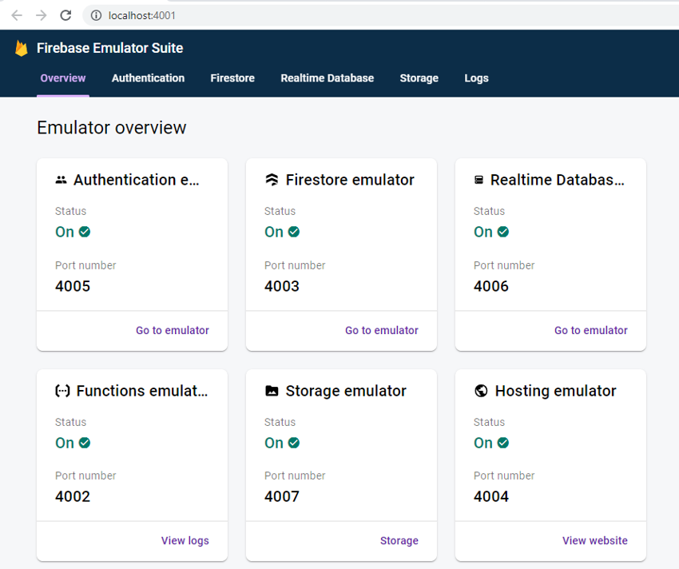
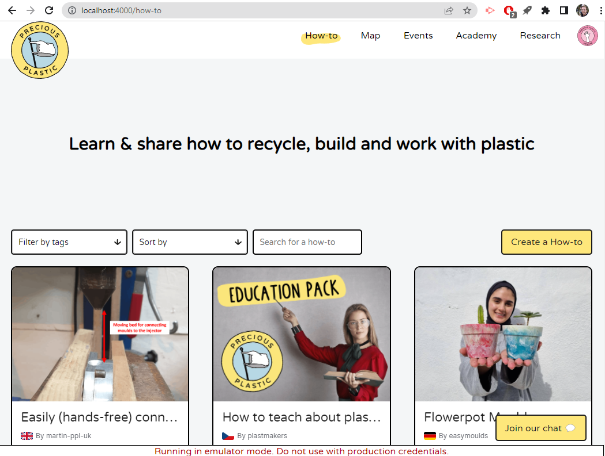
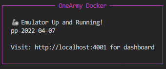

# Firebase Emulators

In order to test backend functions locally, firebase provides a suite of emulators to mimic most functionality seen online (e.g firestore, storage, functions, triggers etc.)

The emulators can be a bit tricky to setup and populate with seed data, and so instead an image has been created in docker that contains all the code to run the emulators and functions code

## Prerequisites

You will need to be able to run `docker` commands locally, the easiest way is to install[Docker Desktop](https://docs.docker.com/desktop/)

## Getting Started

```
yarn start:emulated:docker
```

This will start the following:

- **Docker emulator**  
  May take a few minutes to download the required image

- **Functions src watcher**  
  To recompile functions on update

- **Platform server**  
  On port 4000 to indicate that it should communicate with emulators instead of live site)

## Emulator Dashboard

The emulator should start at http://localhost:4001. Follow the link to see an overview of the available services



Clicking on individual tabs will take you to a page similar to the firebase console, from where you can interact with services.

Note - any data populated into the emulator will be deleted after the emulator has closed (restoring to original state). See the section below about persistant and seed data

## Resetting seed data

When the emulator is stopped the image is destroyed, so each time the emulators are restarted a clean set of data will be available

## Frontend

The frontend should start on http://localhost:4000
You should see a small banner at the bottom of the page that informs emulators are in use.



The data that appears will have been exported at the time the image was made, and so may be slightly outdated when compared to the live site. You can see the time the data was last exported.

You can see the version of data used in the command line output, e.g. data exported from precious plastic on 2022-04-07



### User Login

By default the image comes preloaded with user auth accounts as found in [shared\mocks\auth-users.ts](../../../../shared/mocks/auth-users.ts). This means you can login as any of these users, e.g.

```
email: 'demo_admin@example.com',
password: 'demo_admin',
```

## Function Development

### Writing functions code

TODO docs

- Volume bindings for local functions (should just be able to write locally and see updated in emulators)
- Troubleshooting live-reload

### Invoking functions

TODO docs

- Calling from frontend
- Calling directly

### Accessing Logs

TODO docs

- where to find docs on emulator
- how to exec command to read doc files
- direct container access in vscode

## Extending the image

The code used to build the docker image can all be found in the [packages/emulators-docker](../../../../packages/emulators-docker) workspace.

### Updating seed data

Admins can export data online via google cloud console. Once exported it should be formatted in a namespaced way (e.g. `pp-yyyy-mm-dd` for data exported from precious-plastic) and placed in the seed_data folder for the emulators-docker workspace.

Additionally any references to the previous data should be replaced with the updated (e.g. github action, gitignore and default config defined in workspace common.ts file)

### Custom Image

A custom image can be built and run by passing custom repo or tag args to the build script, e.g.

```
yarn workspace oa-emulators-docker build --repo=my_custom_repo --tag=my_custom_tag
```

That specific image can then either be uploaded to dockerhub (assuming the repo name provided matches a personal repo configured locally) and/or run directly with the start command

```
yarn workspace oa-emulators-docker start --repo=my_custom_repo --tag=my_custom_tag
```

Note - this will only start the emulators, to run the frontend you will also need to run the rest of the scripts found in the src package.json `start:emulated:docker` script separately as required

## Troubleshooting

### Known Issues

TODO docs

- Copy from workspace readme
